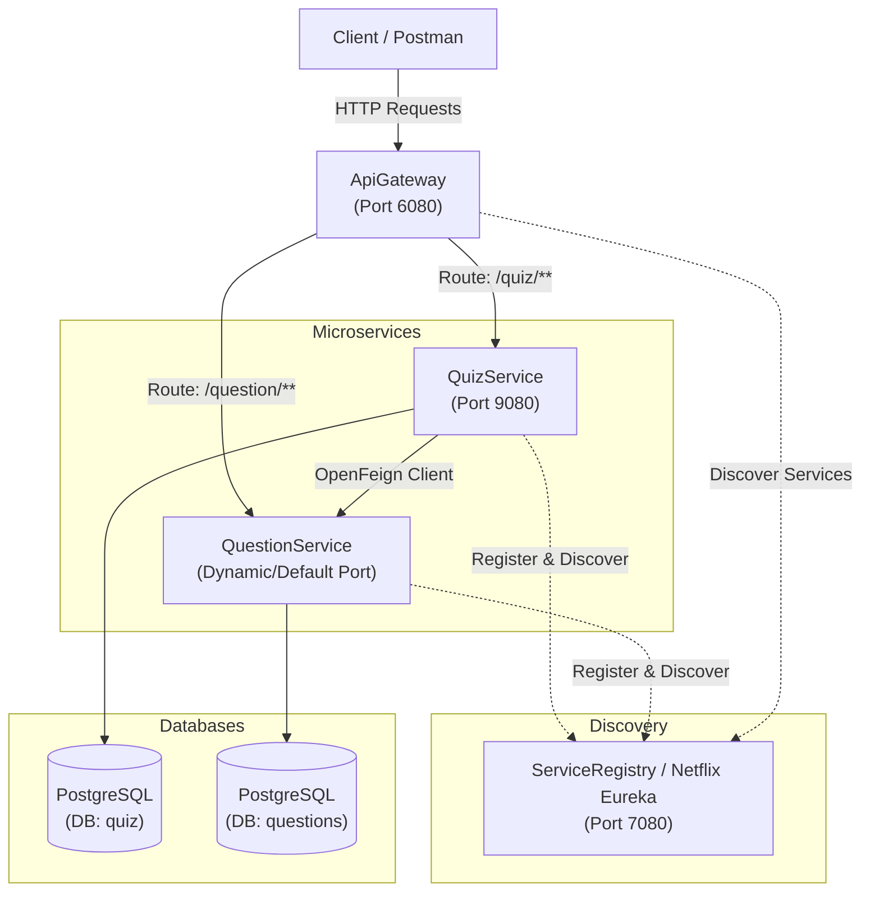

# Spring Boot Microservices Quiz Platform

[](https://www.oracle.com/java/)
[](https://spring.io/projects/spring-boot)
[](https://spring.io/projects/spring-cloud)
[](https://www.postgresql.org/)
[](https://maven.apache.org/)

A distributed, scalable microservices application built with **Spring Boot**, **Spring Cloud**, **Netflix Eureka**, **Spring Cloud Gateway**, and **OpenFeign**. The system allows managing question banks, creating quizzes dynamically based on categories, and evaluating user quiz submissions.

---

## 🏗️ Architecture Overview

The system consists of 4 independent microservices communicating via service discovery and HTTP REST interfaces:



---

## 🧩 Microservices Breakdown

| Service Name | Port | Description |
| :--- | :--- | :--- |
| **[ServiceRegistry](ServiceRegistry)** | `7080` | **Netflix Eureka Server** for service registration and discovery. |
| **[ApiGateway](ApiGateway)** | `6080` | **Spring Cloud Gateway** serving as the single entry point. Handles load balancing and request routing to microservices (`/quiz/**` and `/question/**`). |
| **[question-service](question-service)** | Dynamic / `8080` | Manages the question repository, generates question sets by category, wraps questions (hiding correct answers), and calculates test scores. Connected to PostgreSQL `questions` DB. |
| **[QuizService](QuizService)** | `9080` | Manages quiz entity creation, fetches questions from `question-service` via **OpenFeign**, and processes user quiz responses. Connected to PostgreSQL `quiz` DB. |

---

## 🛠️ Tech Stack & Dependencies

* **Language**: Java 17+
* **Framework**: Spring Boot 3.x, Spring Cloud 2023.x
* **Service Discovery**: Spring Cloud Netflix Eureka
* **API Gateway**: Spring Cloud Gateway (MVC)
* **Inter-Service Communication**: Spring Cloud OpenFeign
* **Database & Persistence**: PostgreSQL, Spring Data JPA / Hibernate
* **Utilities**: Lombok
* **Build Tool**: Apache Maven

---

## 📋 Prerequisites & Database Setup

1. **Java JDK 17** or higher installed.
2. **Apache Maven 3.8+** installed.
3. **PostgreSQL Server** running locally on port `5432`.
4. Create two databases in your PostgreSQL instance:

```sql
CREATE DATABASE questions;
CREATE DATABASE quiz;
```

> [!NOTE]
> Ensure the credentials in `src/main/resources/application.properties` for `question-service` and `QuizService` match your local PostgreSQL configuration:
> * **Username**: `postgres`
> * **Password**: `Karthi@psg` *(update according to your database password)*

---

## 🚀 Getting Started & Execution Order

To run the application locally, start the microservices in the following sequential order:

### 1️⃣ Start the Service Registry (Eureka Server)
```bash
cd ServiceRegistry
mvn spring-boot:run
```
* **Eureka Dashboard**: Navigate to [http://localhost:7080](http://localhost:7080) to check registered instances.

### 2️⃣ Start the Core Microservices
Open separate terminal instances for each service:

```bash
# Start Question Service
cd question-service
mvn spring-boot:run

# Start Quiz Service
cd QuizService
mvn spring-boot:run
```

### 3️⃣ Start the API Gateway
```bash
cd ApiGateway
mvn spring-boot:run
```

---

## 🌐 API Reference (via API Gateway - Port 6080)

All requests should be routed through the **API Gateway** at `http://localhost:6080`.

### ❓ Question Service Endpoints (`/question/**`)

| Method | Endpoint | Description |
| :--- | :--- | :--- |
| `GET` | `/question/allQuestions` | Retrieve all questions from the database |
| `GET` | `/question/category/{category}` | Fetch questions filtered by category |
| `POST` | `/question/add` | Add a new question to the question bank |
| `GET` | `/question/generate?category={cat}&numQuestions={n}` | Inter-service: Generate random question IDs for a quiz |
| `POST` | `/question/getQuestions` | Inter-service: Fetch question details (without answers) by ID list |
| `POST` | `/question/getScore` | Inter-service: Calculate score based on user responses |

#### Request Example: Add Question (`POST /question/add`)
```json
{
  "questionTitle": "What is the default port for Eureka Server in this project?",
  "option1": "8080",
  "option2": "7080",
  "option3": "9080",
  "option4": "6080",
  "rightAnswer": "7080",
  "difficultylevel": "Easy",
  "category": "Java"
}
```

---

### 📝 Quiz Service Endpoints (`/quiz/**`)

| Method | Endpoint | Description |
| :--- | :--- | :--- |
| `POST` | `/quiz/create` | Create a new quiz with specified title, category, and number of questions |
| `GET` | `/quiz/get/{id}` | Get quiz questions by Quiz ID (answers omitted) |
| `POST` | `/quiz/submit` | Submit responses for a quiz and calculate total score |

#### Request Example: Create Quiz (`POST /quiz/create`)
```json
{
  "categoryName": "Java",
  "numOfQuestions": 5,
  "title": "Java Basics Quiz"
}
```

#### Request Example: Submit Quiz (`POST /quiz/submit`)
```json
[
  {
    "id": 1,
    "response": "7080"
  },
  {
    "id": 2,
    "response": "Spring Cloud"
  }
]
```

---

## 🔄 Inter-Service Communication Flow

1. When a user requests to **create a quiz** (`POST /quiz/create`), `QuizService` calls `QuestionService` via **Feign Client** (`QuizInterface`) to fetch `n` random question IDs for the given category.
2. `QuizService` saves the quiz with the generated question IDs in the `quiz` database.
3. When a user fetches a quiz (`GET /quiz/get/{id}`), `QuizService` sends the question IDs to `QuestionService`, which returns `QuestionWrapper` objects (containing only question title & options, hiding the correct answer).
4. When a user submits quiz answers (`POST /quiz/submit`), `QuizService` delegates answer verification to `QuestionService` via Feign Client to compute the final score.

---

## 📁 Repository Structure

```
.
├── ApiGateway/          # Spring Cloud Gateway (Port 6080)
├── ServiceRegistry/     # Netflix Eureka Server (Port 7080)
├── QuizService/         # Quiz Microservice (Port 9080)
├── question-service/    # Question Repository Microservice
└── README.md            # Project documentation
```

---
